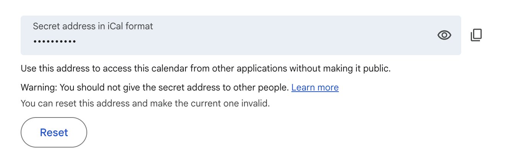
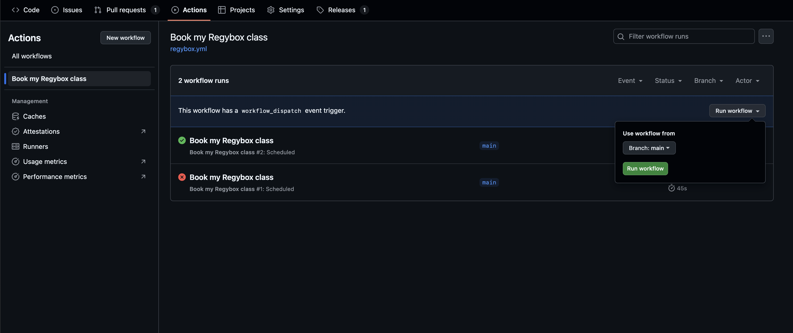

# Regybox Auto-enroller

Automatically enroll in a CrossFit class on the Regybox platform.

This project powers a GitHub Action that books a class for you and can send a confirmation email when it finishes. You can run it on a schedule (for example every morning) or trigger it manually.

## Usage

### 1. Fetch the cookie values from the Regybox website

1. Open [regybox.pt](https://www.regybox.pt/app/app_nova/index.php) and sign in.
2. Open your browser's developer tools (`Cmd+Option+I` on macOS or `Ctrl+Shift+I` on Windows/Linux) and select the **Application** tab.
3. Find the cookies named `PHPSESSID` and `regybox_user`, then copy their values. You will store them later as GitHub Action secrets.


### 2. Create a repository with the GitHub Action

1. Sign in to GitHub and create a [new **private** repository](https://github.com/new) (any name works, for example `regybox`).
2. In the repository, open **Settings → Secrets and variables → Actions** and click **New repository secret**. Paste the cookie values from step 1 into:

   - `PHPSESSID`
   - `REGYBOX_USER`

   

3. Add the workflow file at `.github/workflows/regybox.yml` using the example below. Update the values under the `with:` section (class time, type, secrets, etc.) so they match your preferences.

   ```yaml
   name: Book my Regybox class

   on:
     workflow_dispatch:
     schedule: # 48 hours and 15 minutes in advance for morning classes on weekdays
       # standard time, will be wrong on the last week of march
       - cron: 15 6 * 1-3,11-12 5-6,0-2
       # daylight saving time, will be wrong on the last week of october
       - cron: 15 5 * 4-10 5-6,0-2

   jobs:
     enroll:
       runs-on: ubuntu-latest
       steps:
         - name: Regybox auto enrollment
           uses: martimlobao/regybox@v2
           with:
             class-time: 06:30 # Class start time in HH:MM (24-hour) format
             class-type: WOD Rato # Exact class name as it appears in Regybox
             class-date-offset-days: 2 # Look this many days ahead when booking
             timeout-seconds: 900 # Maximum seconds to wait for enrollment to open
             phpsessid: ${{ secrets.PHPSESSID }}
             regybox-user: ${{ secrets.REGYBOX_USER }}
             calendar-url: ${{ secrets.CALENDAR_URL }}
             send-email: true
             email-to: ${{ secrets.EMAIL_TO }}
             email-username: ${{ secrets.EMAIL_USERNAME }}
             email-password: ${{ secrets.EMAIL_PASSWORD }}
   ```

4. Adjust the `cron` schedules to control when the workflow runs. Cron expressions follow the format `minute hour day-of-month month day-of-week` in **UTC**:
   - The example above (`15 5 * * 1-5`) runs **every weekday at 05:15 UTC**, which is 06:15 in Lisbon during standard time.
   - If enrollment opens 48 hours before each class, schedule the job to run **two days before** the class start time.
   - Start the job **5–15 minutes before** the signup window opens so the booking begins as soon as slots are released.
   - GitHub schedules always use UTC and cannot adjust for daylight saving time. Expect the job to shift by an hour when clocks change and update the schedule if needed.
   - Days of the week use numbers (`0` or `7` for Sunday, `1` for Monday, …, `6` for Saturday). Use ranges like `1-5` for weekdays.
   - Use [crontab.guru](https://crontab.guru/) to preview the schedule before saving.

### 3. Set up email notifications

1. Decide which email account should send confirmations. If you use Gmail, create an [App Password](https://myaccount.google.com/apppasswords) and use it instead of your regular password. The sender and recipient can be the same Gmail address.
2. In **Settings → Secrets and variables → Actions**, create secrets for:
   - `EMAIL_USERNAME` — the email address that will send the notification.
   - `EMAIL_PASSWORD` — the password or app password.
   - `EMAIL_TO` — the address that should receive notifications (usually the same as `EMAIL_USERNAME` for Gmail).
3. Set `send-email: true` in the workflow file so the action sends confirmation emails.


### 4. Set up calendar sync

You can optionally chose to have the auto-enroller check your personal calendar to confirm if there is a class scheduled at the desired time before attempting to enroll in the class. If no such class exists on your calendar, the action will fail to enroll in the class. This may be useful if you are travelling and you do not plan on attending your usual classes: simply delete the classes you do not wish to attend from your calendar and the auto-enroller will not enroll you automatically in the class.

> [!IMPORTANT]
> If you have already enrolled in a class and you delete the class from your calendar, the auto-enroller **will not** unenroll you automatically from the class.

1. Open your calendar provider and locate the secret `.ics` feed URL for your personal calendar. In Google Calendar, open **Settings → Settings for my calendars → Integrate calendar** and copy the **Secret address in iCal format**.
2. Store this URL in the repository as the `CALENDAR_URL` secret.



> [!IMPORTANT]
> Ensure the calendar event for the class is titled **“Crossfit”** so the action recognizes it as a session you plan to attend.

## Summary of secrets

| Secret name      | Required | Description                                                                        |
| ---------------- | :------: | ---------------------------------------------------------------------------------- |
| `PHPSESSID`      |   Yes    | Value of the `PHPSESSID` cookie from regybox.pt.                                   |
| `REGYBOX_USER`   |   Yes    | Value of the `regybox_user` cookie from regybox.pt.                                |
| `EMAIL_USERNAME` |  Yes\*   | Email address that sends confirmations. Required if `send-email` is `true`.        |
| `EMAIL_PASSWORD` |  Yes\*   | Password or app password for `EMAIL_USERNAME`. Required if `send-email` is `true`. |
| `EMAIL_TO`       |  Yes\*   | Email address that receives confirmations. Required if `send-email` is `true`.     |
| `CALENDAR_URL`   |    No    | Secret `.ics` feed URL for your calendar. Enables calendar sync.                   |

> [!TIP]
> After committing the workflow, open the **Actions** tab and run it once with **Run workflow** to confirm the setup. A successful run looks like this:



## Development

This project uses [uv](https://docs.astral.sh/uv/) for dependency management and the `src/` layout for the package code.

- Install dependencies with `uv sync`.
- Run the test suite with `uv run pytest`.
- Lint the code with `make lint` (docformatter, ruff, pylint, bandit, yamllint via uv).
- Type-check the project with `uv run mypy src tests`.
