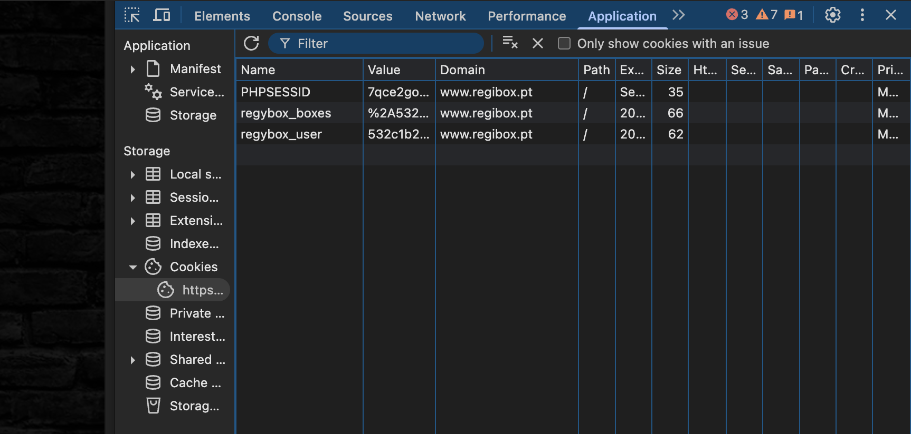
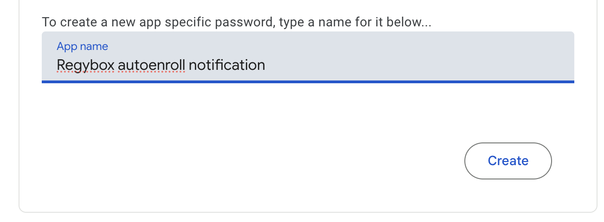
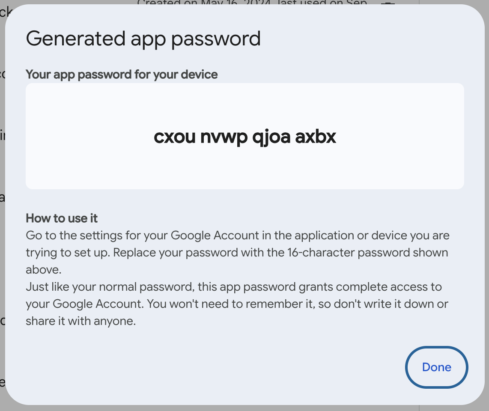
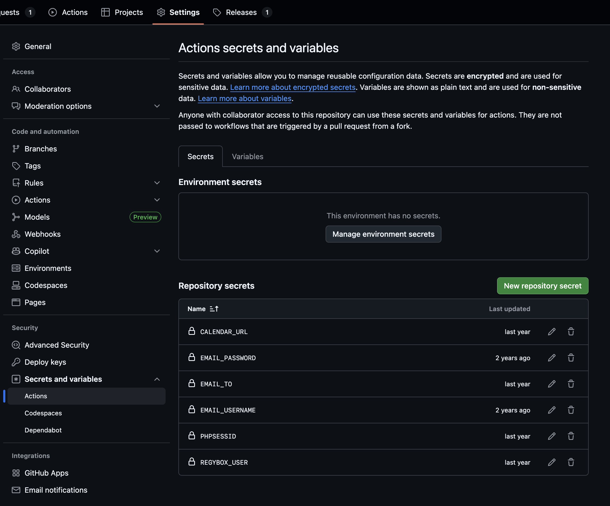

# Regybox Auto-enroller

Automatically enroll in a CrossFit class on the Regybox platform.

This project powers a GitHub Action that books a class for you and can send a confirmation email when it finishes. You can run it on a schedule (for example every morning) or trigger it manually.

## Configuration

The app requires the following environment variables to be set:

- `REGYBOX_USER`: The value for `regybox_user` in the [regybox.pt](https://www.regybox.pt/app/app_nova/index.php) cookie
- `PHPSESSID`: The value for `PHPSESSID` in the [regybox.pt](https://www.regybox.pt/app/app_nova/index.php) cookie
- `CALENDAR_URL`: The .ics URL of the calendar to use for the enrollment

The calendar URL is optional, and is used to check if the user's personal calendar has a CrossFit class planned at the time of the enrollment. If it _does not_, the enrollment is skipped. The calendar must either be public or the URL must be accessible without authentication using the _"Secret address in iCal format"_ provided in Google Calendar.

## Use this project as a ready-made GitHub Action

The steps below explain the entire process as if you have never used GitHub before. Take your time and follow them in order.

### Before you start

1. Open the [regybox.pt](https://www.regybox.pt/app/app_nova/index.php) website in your browser and collect the cookie values for `PHPSESSID` and `regybox_user` by opening the developer tools (usually `Ctrl+Shift+I` or `Cmd+Shift+I`) and clicking on the **Application** tab. You will copy and paste them later.
   
2. Decide which email account you want to use for notifications. If you use Gmail you should create an [App Password](https://myaccount.google.com/apppasswords) and **not** your normal password.
   
   

### Step 1 — Make a home for the workflow

1. [Sign in](https://github.com/login) to GitHub or [create an account](https://github.com/signup) if you don't have one.
2. Create a [new **private** repository](https://github.com/new) (click **New**, give it any name, such as `regybox`).
3. Open the repository you just created.

### Step 2 — Store your secrets safely

1. In the repository, click **Settings** (near the top right).
2. In the left menu, click **Secrets and variables** and then **Actions**.
3. Press the **New repository secret** button for each secret below:
   - **`PHPSESSID`** — paste the PHPSESSID cookie value.
   - **`REGYBOX_USER`** — paste the regybox_user cookie value.
   - **`CALENDAR_URL`** — paste the calendar link (skip this one if you do not use a calendar).
   - **`EMAIL_USERNAME`** — the username for the email account that will send notifications.
   - **`EMAIL_PASSWORD`** — the password or app password for that email account.
   - **`EMAIL_TO`** — the email address that should receive the confirmation messages.
4. Secrets are saved automatically after you click **Add secret**. Repeat until all of them appear in the list.



### Step 3 — Add the workflow file

1. Go back to the **Code** tab of your repository.
2. Click the green **Add file** button and choose **Create new file**.
3. Type `.github/workflows/regybox.yml` as the file name (include the folders).
4. Paste the following text into the editor. If you do not want to use a tagged release, replace `@v2` with `@main`.
5. Update the `cron` line to the time you want the booking to run. Schedules are written in [UTC](https://en.wikipedia.org/wiki/Coordinated_Universal_Time) and do **not** adjust for daylight saving changes, so the run may happen an hour earlier or later when clocks change.
6. If you need the enrollment to happen right when the class opens, set the schedule to start **5—15 minutes before** the signup window. GitHub sometimes takes a few minutes to start the job.

   ```yaml
   name: Book my Regybox class

   on:
     schedule: # 48 hours and 15 minutes in advance for morning classes on weekdays
       # standard time, will be off on the last week of march
       - cron: 15 6 * 1-3,11-12 5-6,0-2
       # daylight saving time, will be off on the last week of october
       - cron: 15 5 * 4-10 5-6,0-2
     workflow_dispatch: {}

   jobs:
     enroll:
       runs-on: ubuntu-latest
       steps:
         - name: Run the Regybox Auto Enroll action
           uses: martimlobao/regybox@v2
           with:
             class-time: "06:30"
             class-type: WOD Rato
             class-date-offset-days: 2
             phpsessid: ${{ secrets.PHPSESSID }}
             regybox-user: ${{ secrets.REGYBOX_USER }}
             calendar-url: ${{ secrets.CALENDAR_URL }}
             send-email: true
             email-to: ${{ secrets.EMAIL_TO }}
             email-username: ${{ secrets.EMAIL_USERNAME }}
             email-password: ${{ secrets.EMAIL_PASSWORD }}
   ```

7. Scroll down and click **Commit new file**.
8. For a real-world example, check the [scheduled_runs.yml](.github/workflows/scheduled_runs.yml) and [scheduled_holiday_runs.yml](.github/workflows/scheduled_holiday_runs.yml) files in this repository.

`class-time` and `class-type` are required. Change them to match the exact class you want. `class-date-offset-days` controls how many days in advance the script will look for the class (for example, `2` means "three days from today").

### Step 4 — Test the workflow

1. Click the **Actions** tab in your repository. GitHub may ask you to enable workflows—click **I understand my workflows, go ahead and enable them**.
2. In the left sidebar, choose **Book my Regybox class**.
3. Press **Run workflow**, keep the default `main` branch selected, and press **Run workflow** again. This launches a test run immediately.
4. Wait for the job to finish. Assuming you selected a class that is open for enrollment, you should see a green check mark, and a confirmation email if you left notifications enabled.
5. If the run fails, open the failed step to read the message. Fix the issue (for example, double-check your cookies, or confirm the class you selected is open for enrollment) and repeat this test.


### Step 5 — Let it run automatically

After the test succeeds, the workflow will continue to run on the schedule you configured. You can return to the **Actions** tab any time to confirm it is still working.

### Make it your own

- **Change the schedule:** Update the `cron` line in the workflow file. Use [crontab.guru](https://crontab.guru/) if you are unsure how to express the time you want.
- **Pick a different class:** Edit `class-type`, `class-time`, or `class-date-offset-days` to match the class you need.
- **Skip emails:** Change `send-email` to `false` and remove the email-related lines.

## Development

This project uses [uv](https://docs.astral.sh/uv/) for dependency management and the `src/` layout for the package code.

- Install dependencies with `uv sync`.
- Run the test suite with `uv run pytest`.
- Lint the code with `make lint` (docformatter, ruff, pylint, bandit, yamllint via uv).
- Type-check the project with `uv run mypy src tests`.
