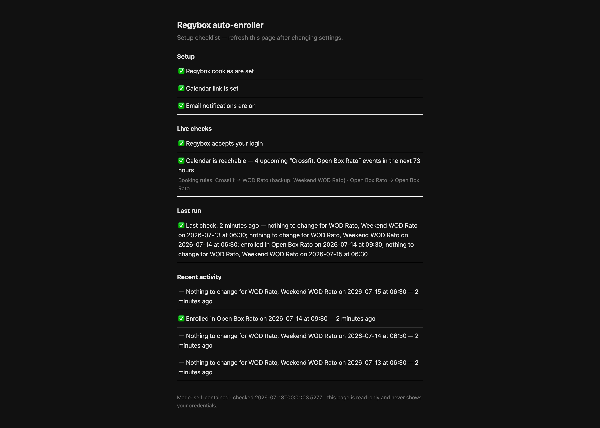
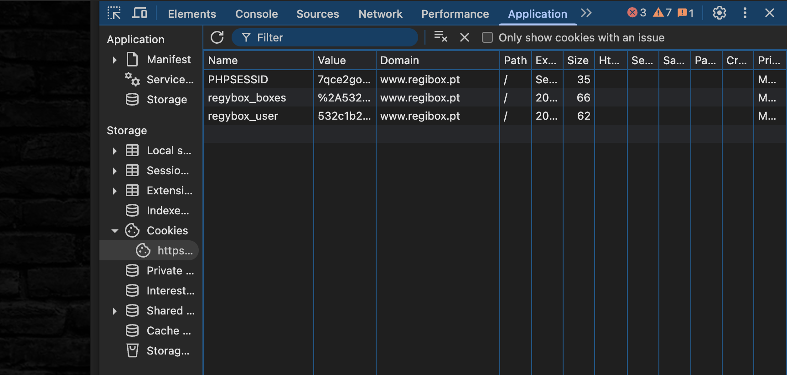
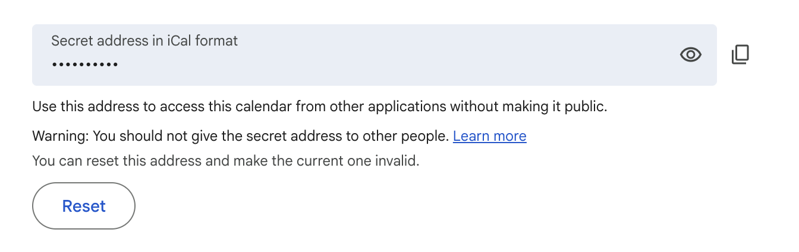
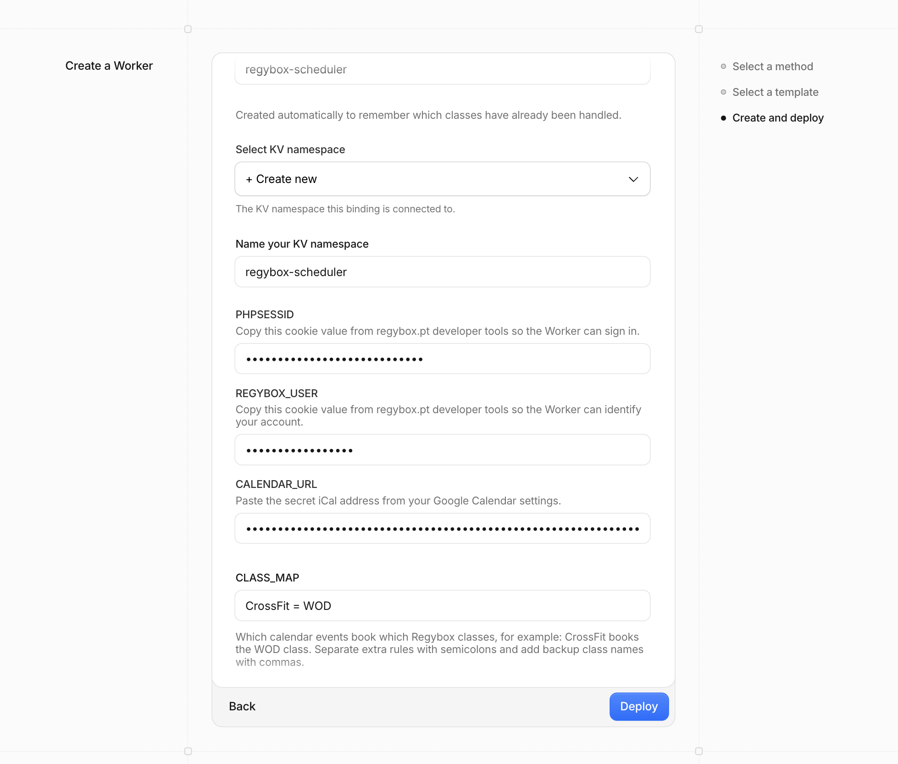
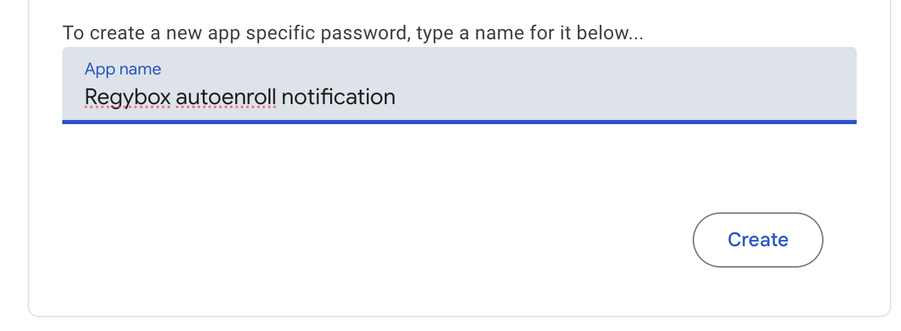
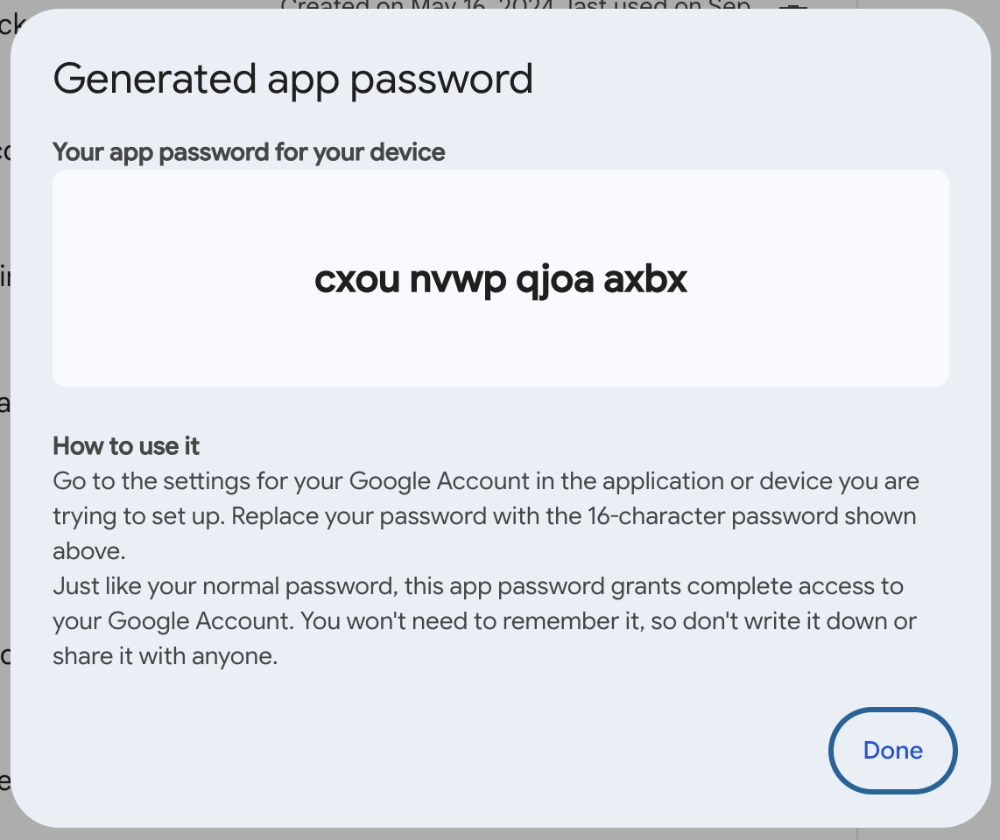

# Regybox Auto-Enroller

[](https://docs.astral.sh/uv/)
[](https://codecov.io/gh/martimlobao/regybox)



Automatically enroll in a CrossFit class on the Regybox platform.

Add your classes to your calendar (or delete one to skip a day), and this project
books and cancels the matching Regybox classes for you, optionally emailing you a
confirmation. Use the [one-click Cloudflare setup](#one-click-cloudflare-setup):
a Cloudflare Worker checks your calendar every half hour and books classes
directly, with no fixed schedule to maintain. ([Legacy setup instructions](docs/legacy-setups.md)
remain available for existing installations.)

## One-Click Cloudflare Setup

Everything runs in a free Cloudflare account that you own: your credentials stay
with you, and there is no server to maintain. You need a Cloudflare account and a
GitHub account (both free — GitHub is only used to store your copy of the code).

### 1. Copy Your Regybox Cookies

1. Open [regybox.pt](https://www.regybox.pt/app/app_nova/index.php) and sign in.
2. Open your browser's developer tools (`Cmd+Option+I` on macOS or `Ctrl+Shift+I` on
   Windows/Linux) and select the **Application** tab.
3. Find the cookies named `PHPSESSID` and `regybox_user` and copy their values
   somewhere handy — you will paste them during the deploy step.



### 2. Copy Your Secret Calendar Link

1. In [Google Calendar settings](https://calendar.google.com/calendar/r/settings),
   pick your calendar under **Settings for my calendars** and open
   **Integrate calendar**.
2. Copy the **Secret address in iCal format**.



### 3. Deploy to Cloudflare

[](https://deploy.workers.cloudflare.com/?url=https://github.com/martimlobao/regybox/tree/main/cloudflare/regybox-scheduler)

1. Click the button above and sign in to Cloudflare (and GitHub, when asked).
2. Fill in the values it asks for (each field explains where its value comes from):
    - `PHPSESSID` and `REGYBOX_USER` — the cookie values from step 1.
    - `CALENDAR_URL` — the secret calendar link from step 2.
    - `CLASS_MAP` — which calendar events book which Regybox classes. Each rule is
      `Calendar event = Regybox class`; separate several rules with `;` and give
      backup class names with commas. Examples:

      ```text
      CrossFit = WOD
      Weightlifting = Weightlifting Rato; CrossFit = WOD, Weekend WOD
      ```

      The second example books `Weightlifting Rato` for calendar events titled
      "Weightlifting", and for events titled "CrossFit" tries `WOD` first and
      `Weekend WOD` if there is no `WOD` at that time.

   

3. Click **Create and deploy**. Cloudflare creates the storage and the half-hourly
   schedule automatically. You can skip everything under **Advanced settings** —
   the "Variable name/value" fields there are build-time settings and do not
   affect the running Worker.

To change any of these values later, open the Worker in the Cloudflare dashboard
and edit them under **Settings → Variables and Secrets** — the status page (step 6)
always shows the booking rules currently in effect. Your dashboard values stay in
place when the Worker is redeployed; in particular, updates do not replace your
`CLASS_MAP`, cookies, calendar URL, or email settings.

#### Keep the Status Page Private (Recommended)

Use [Cloudflare Access](https://developers.cloudflare.com/workers/configuration/routing/workers-dev/#manage-access-to-workersdev)
to let only your email address open the status page and incident reports:

1. Open the Worker, then go to **Settings → Domains & Routes**.
2. Beside `workers.dev`, select **Enable Cloudflare Access**, then **Manage
   Cloudflare Access**.
3. Edit the new **Allow** policy. Under **Include**, choose **Emails** and enter
   only the exact email address that should have access.
   If `EMAIL_TO` is different and must open emailed incident links, add that
   exact address too. It must also be able to sign in through a configured
   identity provider. For a non-account-member address, go to **Zero Trust →
   Integrations → Identity providers → Add new identity provider →
   One-time PIN** ([instructions](https://developers.cloudflare.com/cloudflare-one/integrations/identity-providers/one-time-pin/)),
   or add another provider. Keep **Include → Emails** limited to exact addresses.
4. Inspect every policy in this Access application. For strict single-user
   access, keep one exact-email **Allow** policy and remove any other broader
   **Allow** or **Bypass** policy. A narrow exact-email rule does not override a
   second policy that grants broader access. Also remove any broader **Include**
   rule: **Everyone**, **Login Methods → One-time PIN** (which includes all valid
   email addresses), an email-domain rule such as **Emails ending in**, or
   **Cloudflare Account Member**. One-time PIN itself is fine as a sign-in method
   or **Require** rule when **Include → Emails** stays limited to exact addresses.
   See Cloudflare's
   [Access policy guide](https://developers.cloudflare.com/cloudflare-one/access-controls/policies/)
   for details.
5. Save the changes, then test the `workers.dev` link in a private/incognito
   window. With one-time PIN sign-in, Cloudflare emails a single-use code only
   to an address allowed by the policy; for privacy, the screen still says a
   code was sent when a blocked address tries to sign in.

After this, the status page and incident-report links require the allowed
identity. The Worker's scheduled checks, enrollment, and cancellation continue
normally in the background.

### 4. Turn on Automatic Updates (Recommended)

Step 3 did two things: Cloudflare created a new GitHub repository for your copy
of Regybox, then deployed the Worker from that repository. That new repository
does **not** contain or need a Regybox updater GitHub Action. Updates are handled
centrally from [`martimlobao/regybox`](https://github.com/martimlobao/regybox).

There is one final, one-time setup step:

1. Open the [Regybox Updater installation page](https://github.com/apps/regybox-updater/installations/new).
2. Choose **Only select repositories**.
3. Select only the new repository that Cloudflare created in step 3, then
   approve the installation.

That is all you need to configure. Do not copy an updater workflow into your
repository and do not add a GitHub token.

#### What Happens After Setup

1. A relevant Worker or updater change merged into the `main` branch of
   `martimlobao/regybox` starts the central updater. A daily reconciliation also
   catches anything that was temporarily missed.
2. The updater looks only at repositories where the Regybox Updater App is
   installed and checks the `.regybox-deployment.json` marker. Missing,
   malformed, disabled, or mismatched identity/schema markers are skipped. The
   updater itself maintains the marker's `installedCommit` value.
3. For an opted-in repository, it replaces upstream-managed Worker files and
   deletes managed files that were removed upstream. User-added, unmanaged files
   are generally left alone. It explicitly protects the top-level `.github`,
   `.wrangler`, `node_modules`, `.regybox-deployment.json`, `.env`, `.env.*`,
   `.dev.vars`, and `.dev.vars.*` areas.
4. Its configuration merge preserves the Worker name and KV namespace IDs and
   tells Cloudflare to keep dashboard-owned variables and secrets. That is why
   values such as `CLASS_MAP`, cookies, calendar settings, and email settings
   remain unchanged.
5. It commits the update to the repository's default branch. Cloudflare's Git
   integration sees that commit and deploys it.
6. If branch protection blocks the direct push, the updater opens or refreshes
   a `regybox-updater/main` pull request instead. You must approve and merge that
   pull request; otherwise the normal path is fully automatic.

#### Check, Pause, or Troubleshoot Updates

- **Check an update:** open the repository's commit history and look for
  `chore: update Regybox scheduler`, then confirm the same commit has a
  successful deployment in the Cloudflare dashboard. A daily check creates no
  commit when the repository is already current.
- **Pause or disable:** remove the repository from the Regybox Updater App or
  uninstall the App. Advanced users can temporarily change `mode` from `auto`
  in `.regybox-deployment.json`; change it back to `auto` to resume.
- **Nothing is updating:** confirm that the App installation still includes the
  correct repository and that `.regybox-deployment.json` exists at the
  repository root with the expected Regybox upstream, `main` channel, and
  `"mode": "auto"`. Also check for an open updater pull request, which means
  branch protection requires your approval.

#### App Access and Credential Safety

The App cannot directly read variables or secrets from your Cloudflare dashboard
through GitHub, and the routine configuration merge preserves those values.
However, its **Contents: read and write** permission lets the central updater
commit upstream Worker code, which Cloudflare then deploys automatically.
Deployed Worker code can use that Worker's bindings and secrets at runtime, so
installing the App means trusting the Regybox updater and upstream code as an
automatic update channel.

Never commit Cloudflare or Regybox credentials, cookies, calendar URLs, or email
passwords to the repository. The App's least-privilege GitHub permissions are
**Metadata: read**, **Contents: read and write**, and **Pull requests: read and
write**; it does not request Actions or Workflows permissions.

### 5. Optional: Turn on Email Notifications

You will get an email when a class is booked or cancelled, or when something needs
your attention (like an expired login). Runs that change nothing stay silent. Failure
emails include a private, hard-to-guess link to a sanitized incident report with the
details needed for troubleshooting. Reports expire after seven days and never contain
cookies, passwords, calendar links, full booking URLs, or URL query tokens.

1. If you use Gmail, create an [App Password](https://myaccount.google.com/apppasswords)
   — a special password just for this Worker; your normal password never leaves
   Google. Give it any name (for example `regybox`) and copy the generated value.

   

   

2. Open the Worker in the Cloudflare dashboard and go to
   **Settings → Variables and Secrets**. Add three secrets:
    - `EMAIL_USERNAME` — the Gmail address that sends the notification.
    - `EMAIL_PASSWORD` — the App Password from the previous step.
    - `EMAIL_TO` — the address that receives notifications (usually the same as
      `EMAIL_USERNAME`).

3. Refresh the status page (step 6) — it should now say "Email notifications are on".

### 6. Check That It Works

Open your Worker's page (Cloudflare dashboard → **Workers & Pages** →
**regybox-scheduler** → the `workers.dev` link). It shows a plain-English
checklist: whether your login works, whether your calendar is reachable, how many
upcoming classes it found, and what the last run did. If something is red, the
page tells you how to fix it.

From then on it books any class that appears on your calendar (usually the moment
enrollment opens) and cancels a booking if you delete the event. When your
Regybox login eventually expires, the status page and the notification email will
tell you — copy fresh cookie values from regybox.pt and update `PHPSESSID` under
**Settings → Variables and Secrets**, then you're back in business.

### Seeing What It's Doing

- **Status page** (the `workers.dev` link): the **Recent activity** section lists the
  last bookings, cancellations, and failures with timestamps, and **Last run** shows
  what the most recent half-hourly check did — including "nothing to do".
- **Failure email link**: opens a read-only incident report containing safe parser and
  operation details. The link works for seven days. Open the status page once after
  deployment so scheduled runs know the Worker's public address; alternatively set
  `STATUS_URL` to that address under **Settings → Variables and Secrets**.
- **Cloudflare logs**: in the dashboard, open the Worker → **Logs** to see every run
  (searchable, kept for a few days). Every log line the scheduler writes starts with
  `regybox:`, for example `regybox: enroll WOD on 2026-07-14 at 06:30 -> success`.
- **Live tail** (for the technically inclined): `bunx wrangler tail <worker-name>`
  streams runs as they happen.

## Development

This project uses [uv](https://docs.astral.sh/uv/) for dependency management and the `src/` layout for the package code.

- Install dependencies with `uv sync`.
- Run the test suite with `uv run pytest`.
- Lint the code with `make lint` (docformatter, ruff, bandit, yamllint via uv).
- Type-check the project with `uv run pyright` and `uv run ty check`.
