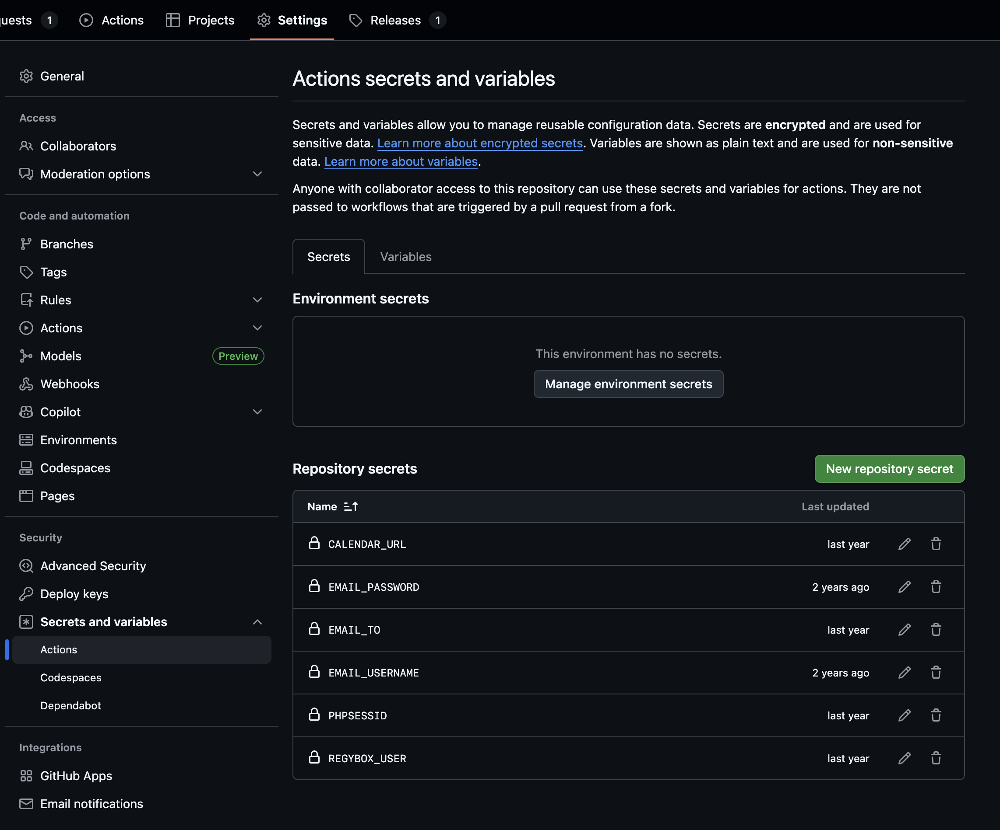
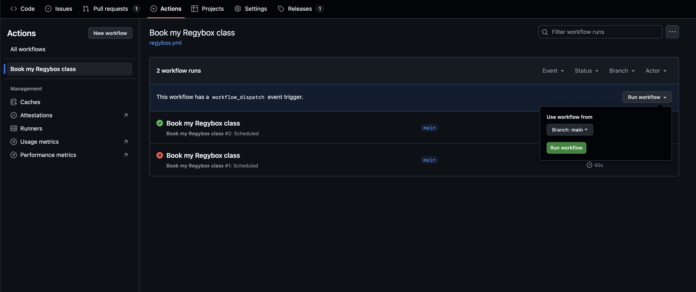

# Regybox Auto-Enroller

[](https://docs.astral.sh/uv/)
[](https://codecov.io/gh/martimlobao/regybox)

Automatically enroll in a CrossFit class on the Regybox platform.

Add your classes to your calendar (or delete one to skip a day), and this project
books and cancels the matching Regybox classes for you, optionally emailing you a
confirmation. There are three ways to run it — pick one:

1. **[One-click Cloudflare setup](#recommended-one-click-cloudflare-setup)**
   (recommended): a Cloudflare Worker checks your calendar every half hour and
   books classes directly. Easiest to set up, no fixed schedule to maintain.
2. **[GitHub Action with a fixed schedule](#alternative-github-action-with-a-fixed-schedule)**:
   books the same class at the same time every week. No Cloudflare account needed.
3. **[Cloudflare Worker → GitHub Actions dispatch](#advanced-calendar-driven-sync-with-cloudflare-and-github)**
   (advanced): the original calendar-driven setup, kept for existing users.

## Recommended: One-Click Cloudflare Setup

Everything runs in a free Cloudflare account that you own: your credentials stay
with you, and there is no server to maintain. You need a Cloudflare account and a
GitHub account (both free — GitHub is only used to store your copy of the code).

### 1. Copy Your Regybox Cookies

1. Open [regybox.pt](https://www.regybox.pt/app/app_nova/index.php) and sign in.
2. Open your browser's developer tools (`Cmd+Option+I` on macOS or `Ctrl+Shift+I` on
   Windows/Linux) and select the **Application** tab.
3. Find the cookies named `PHPSESSID` and `regybox_user` and copy their values
   somewhere handy — you will paste them during the deploy step.


### 2. Copy Your Secret Calendar Link

1. In [Google Calendar settings](https://calendar.google.com/calendar/r/settings),
   pick your calendar under **Settings for my calendars** and open
   **Integrate calendar**.
2. Copy the **Secret address in iCal format**.


### 3. Deploy to Cloudflare

[](https://deploy.workers.cloudflare.com/?url=https://github.com/martimlobao/regybox/tree/main/cloudflare/regybox-scheduler)

1. Click the button above and sign in to Cloudflare (and GitHub, when asked).
2. Fill in the values it asks for:
    - `PHPSESSID` and `REGYBOX_USER` — the cookie values from step 1.
    - `CALENDAR_URL` — the secret calendar link from step 2.
    - `CLASS_MAP` — which calendar events book which Regybox classes. Each rule is
      `Calendar event = Regybox class`; separate several rules with `;` and give
      backup class names with commas. Examples:

      ```text
      CrossFit = WOD
      Weightlifting = Weightlifting Rato; CrossFit = WOD, Weekend WOD
      ```

      The second example books `Weightlifting Rato` for calendar events titled
      "Weightlifting", and for events titled "CrossFit" tries `WOD` first and
      `Weekend WOD` if there is no `WOD` at that time.
3. Click **Create and deploy**. Cloudflare creates the storage and the half-hourly
   schedule automatically.

### 4. Optional: Turn on Email Notifications

After the Worker is deployed, open it in the Cloudflare dashboard and go to
**Settings → Variables and Secrets**. Add three secrets: `EMAIL_USERNAME` and
`EMAIL_TO` (usually the same address) and `EMAIL_PASSWORD` — for Gmail, use an
[App Password](https://myaccount.google.com/apppasswords), not your normal
password. You will get an email when a class is booked or cancelled, or when
something needs your attention (like an expired login). No-op runs stay silent.

### 5. Check That It Works

Open your Worker's page (Cloudflare dashboard → **Workers & Pages** →
**regybox-scheduler** → the `workers.dev` link). It shows a plain-English
checklist: whether your login works, whether your calendar is reachable, how many
upcoming classes it found, and what the last run did. If something is red, the
page tells you how to fix it.

From then on it books any class that appears on your calendar (usually the moment
enrollment opens) and cancels a booking if you delete the event. When your
Regybox login eventually expires, the status page and the notification email will
tell you — copy fresh cookie values from regybox.pt and update `PHPSESSID` under
**Settings → Variables and Secrets**, then you're back in business.

## Alternative: GitHub Action with a Fixed Schedule

Use this if you want the same class booked at the same times every week and prefer
not to create a Cloudflare account. Note that GitHub's scheduler can start runs
several minutes late, which can matter for classes that fill up quickly.

### 1. Fetch the Cookie Values from the Regybox Website

1. Open [regybox.pt](https://www.regybox.pt/app/app_nova/index.php) and sign in.
2. Open your browser's developer tools (`Cmd+Option+I` on macOS or `Ctrl+Shift+I` on
   Windows/Linux) and select the **Application** tab.
3. Find the cookies named `PHPSESSID` and `regybox_user`, then copy their values. You
   will store them later as GitHub Action secrets.

### 2. Create a Repository with the GitHub Action

1. Sign in to GitHub and create a [new **private** repository](https://github.com/new) (any name
   works, for example `regybox`).
2. In the repository, open **Settings → Secrets and variables → Actions** and click
   **New repository secret**. Paste the cookie values from step 1 into:

    - `PHPSESSID`

    - `REGYBOX_USER`

   

   > [!NOTE]
   > If you want your calendar to drive enrollments and unenrollments, use the
   > [one-click Cloudflare setup](#recommended-one-click-cloudflare-setup) instead of a
   > fixed-class GitHub schedule.

3. Add the workflow file at `.github/workflows/regybox.yml` using the example below.
   Update the values under the `with:` section (class time, type, secrets, etc.) so they
   match your preferences.

   ```yaml
   name: Book my Regybox class

   on:
     workflow_dispatch:
     schedule: # 48 hours and 15 minutes in advance for morning classes on weekdays
       # standard time, will be wrong on the last week of march
       - cron: 15 6 * 1-3,11-12 5-6,0-2
       # daylight saving time, will be wrong on the last week of october
       - cron: 15 5 * 4-10 5-6,0-2

   jobs:
     enroll:
       runs-on: ubuntu-latest
       steps:
         - name: Regybox auto enrollment
           uses: martimlobao/regybox@v2
           with:
             class-time: 06:30 # Class start time in HH:MM (24-hour) format
             class-type: WOD # Exact class name as it appears in Regybox
             calendar-event-name: CrossFit # Optional calendar title override; defaults to CrossFit
             class-date-offset-days: 2 # Look this many days ahead when booking
             timeout-seconds: 900 # Maximum seconds to wait for enrollment to open
             phpsessid: ${{ secrets.PHPSESSID }}
             regybox-user: ${{ secrets.REGYBOX_USER }}
             calendar-url: ${{ secrets.CALENDAR_URL }}
             send-email: true
             email-to: ${{ secrets.EMAIL_TO }}
             email-username: ${{ secrets.EMAIL_USERNAME }}
             email-password: ${{ secrets.EMAIL_PASSWORD }}
   ```

4. Adjust the `cron` schedules to control when the workflow runs. Cron expressions follow the
   format `minute hour day-of-month month day-of-week` in **UTC**:
    - The example above (`15 5 * * 1-5`) runs **every weekday at 05:15 UTC**, which is 06:15 in
      Lisbon during standard time.
    - If enrollment opens 48 hours before each class, schedule the job to run **two days before**
      the class start time.
    - Start the job **5–15 minutes before** the signup window opens so the booking begins as soon
      as slots are released.
    - GitHub schedules always use UTC and cannot adjust for daylight saving time. Expect the job
      to shift by an hour when clocks change and update the schedule if needed.
    - Days of the week use numbers (`0` or `7` for Sunday, `1` for Monday, …, `6` for Saturday).
      Use ranges like `1-5` for weekdays.
    - Use [crontab.guru](https://crontab.guru/) to preview the schedule before saving.

`class-type` can also be a comma-separated fallback list. For example, `WOD,Weekend WOD` tries
`WOD` first and then `Weekend WOD` if the first class name is not found at that date and time.

### 3. Set Up Email Notifications

1. Decide which email account should send confirmations. If you use Gmail, create an
   [App Password](https://myaccount.google.com/apppasswords) and use it instead of your regular
   password. The sender and recipient can be the same Gmail address.
2. In **Settings → Secrets and variables → Actions**, create secrets for:
    - `EMAIL_USERNAME` — the email address that will send the notification.
    - `EMAIL_PASSWORD` — the password or app password.
    - `EMAIL_TO` — the address that should receive notifications (usually the same as
      `EMAIL_USERNAME` for Gmail).
3. Set `send-email: true` in the workflow file so the action sends confirmation emails.


### 4. Set Up Calendar Checks

You can optionally choose to have the auto-enroller check your personal calendar to confirm if
there is a class scheduled at the desired time before attempting to enroll in the class. If no such
class exists on your calendar, the action will fail to enroll in the class. This may be useful if
you are travelling and you do not plan on attending your usual classes: simply delete the classes
you do not wish to attend from your calendar and the auto-enroller will not enroll you
automatically in the class.

> [!IMPORTANT]
> If you have already enrolled in a class and you delete the class from your calendar, the
> auto-enroller **will not** unenroll you automatically from the class.

1. Open your calendar provider and locate the secret `.ics` feed URL for your personal calendar.
   In Google Calendar, open **Settings → Settings for my calendars → Integrate calendar** and copy
   the **Secret address in iCal format**.
2. Store this URL in the repository as the `CALENDAR_URL` secret.
3. If your calendar uses a different title than `CrossFit`, set `calendar-event-name` in the
   workflow. If omitted, the action matches the calendar event title against `CrossFit`.


> [!IMPORTANT]
> The calendar match is case-insensitive and ignores leading/trailing spaces. By default, the
> action looks for an event whose title matches `CrossFit`.

## Advanced: Calendar-Driven Sync with Cloudflare and GitHub

> [!NOTE]
> This is the original calendar-driven setup, kept for people who already run it or who want
> GitHub Actions to perform the enrollment. New users should prefer the
> [one-click Cloudflare setup](#recommended-one-click-cloudflare-setup), which does the same
> thing without GitHub tokens or Cloudflare API tokens. The same Worker powers both: if the
> `GITHUB_TOKEN`, `GITHUB_OWNER`, and `GITHUB_REPO` variables are set it dispatches GitHub
> Actions as described below; otherwise it books classes itself.

GitHub scheduled workflows can run late. For calendar-driven scheduling, use a Cloudflare Worker
Cron Trigger to check your calendar at `:28` and `:58` every hour and dispatch a GitHub workflow
only when a specific class needs to be enrolled or unenrolled.

The `:28` and `:58` trigger minutes are intentional. They give Cloudflare and GitHub a small
startup lead before classes or enrollment windows that open exactly on the hour or half-hour. For
example, a `06:30` enrollment window is discovered by the `06:28` trigger, so the GitHub Action has
time to queue, start the runner, log in, and reach Regybox closer to `06:30`.

This approach is different from a fixed GitHub schedule:

- The Worker reads your calendar for the next `LOOKAHEAD_HOURS`, default `73`.
- The Worker stores state in Cloudflare KV, so it does not trigger a GitHub Action when the class
  is already cached as enrolled.
- GitHub Actions still performs the Regybox login, enrollment, unenrollment, KV update, and email
  notification.
- Emails are sent only for successful enrollments, successful unenrollments, or real errors. No-op
  runs such as already enrolled or enrollment not open yet do not send email.
- If you manually unenroll from a class, the KV entry suppresses re-enrollment while the calendar
  event remains present.

Calendar event names and Regybox class names are configured with the same `CLASS_MAP` variable
used by the one-click setup, for example `CLASS_MAP=Crossfit = WOD`. Older deployments that set
`CALENDAR_EVENT_NAMES` and `CLASS_TYPE` keep working unchanged when `CLASS_MAP` is not set:

```text
CALENDAR_EVENT_NAMES=Crossfit
CLASS_TYPE=WOD
```

With the legacy pair, commas provide multiple values, for example
`CALENDAR_EVENT_NAMES=Crossfit,Strength` or `CLASS_TYPE=WOD,Weekend WOD`. Note that the legacy
pair applies the same `CLASS_TYPE` to every calendar event name; use `CLASS_MAP` when different
events should book different classes.

### Cloudflare Setup

You will configure three separate things:

- A GitHub workflow that performs one exact class operation.
- A Cloudflare KV namespace for 30-day scheduler state.
- A Cloudflare Worker that reads your calendar and dispatches GitHub only when needed.

#### 1. Create the GitHub Workflow

Commit `.github/workflows/class_operation.yml` in your automation repository. The workflow in this
repository can be used as-is if your automation repository is this repo.

After the workflow exists on the default branch, open **GitHub → Actions → Regybox Class Operation
→ Run workflow** once and enter:

- `operation`: `enroll`.
- `class-date`: a test class date in `YYYY-MM-DD` format.
- `class-time`: a test class time in `HH:MM` format.
- `class-type`: the exact Regybox class name, for example `WOD`.
- `cache-key`: a temporary value such as `regybox:v1:test`.

If enrollment is not open yet, the workflow should no-op without sending an email.

#### 2. Create a Cloudflare KV Namespace

1. Open the [Cloudflare dashboard](https://dash.cloudflare.com/).
2. Go to **Storage & databases → Workers KV**.
3. Click **Create Instance**.
4. Name it something like `regybox-sync-state`.
5. Open the new KV instance and go to the **Metrics** tab.
6. Copy the namespace ID. You will store it in GitHub as `CF_KV_NAMESPACE_ID`.

#### 3. Create a Cloudflare API Token for GitHub Actions

The GitHub workflow uses Cloudflare's REST API to write KV cache keys after successful state
changes.

1. In Cloudflare, go to **Manage account → Account API tokens**.
2. Click **Create Token**.
3. Name it `regybox-github-kv`.
4. Add account-level permissions for **Workers KV Storage: Edit**.
5. Click **Review token**.
6. Click **Create token**.
7. Copy **Account ID** and **Your API Token** from this screen.

In GitHub, open **Settings → Secrets and variables → Actions** and add:

- `CF_ACCOUNT_ID` — the **Account ID** value from Cloudflare.
- `CF_KV_NAMESPACE_ID` — the KV namespace ID from step 2.
- `CF_KV_API_TOKEN` — the **Your API Token** value from Cloudflare.

#### 4. Create a GitHub Token for the Cloudflare Worker

The Worker needs a GitHub token that can call the workflow dispatch endpoint.

1. Open [GitHub fine-grained personal access tokens](https://github.com/settings/personal-access-tokens).
2. Click **Generate new token**.
3. Give the token a clear name, such as `regybox-cloudflare-dispatch`.
4. Choose an expiration. Use **No expiration** if you do not want to rotate this token later.
5. Set **Repository access** to only the repository containing `class_operation.yml`.
6. Under repository permissions, set **Actions** to **Read and write**.
7. Generate the token and copy it.

#### 5. Create the Cloudflare Worker

1. In Cloudflare, go to **Compute → Workers & Pages**.
2. Click **Create application**.
3. Click **Start with Hello World!**.
4. Rename the Worker to `regybox-scheduler`.
5. Click **Deploy**.
6. Click **Edit code**.
7. Create the `src/calendar.js` and `src/index.js` modules, then paste the contents of
   [`cloudflare/regybox-scheduler/src/calendar.js`](cloudflare/regybox-scheduler/src/calendar.js) and
   [`cloudflare/regybox-scheduler/src/index.js`](cloudflare/regybox-scheduler/src/index.js) into the
   corresponding tabs.
8. Click **Deploy**.

If you deploy with Wrangler instead, set `CF_KV_NAMESPACE_ID` to the KV namespace ID from step 2
and run the Worker package from [`cloudflare/regybox-scheduler`](cloudflare/regybox-scheduler):

```bash
cd cloudflare/regybox-scheduler
CF_KV_NAMESPACE_ID=<your-kv-namespace-id> bun run deploy
```

From the repository root you can also run `make deploy-worker` after exporting
`CF_KV_NAMESPACE_ID`.

`bun run deploy` renders `.wrangler.deploy.jsonc` from `wrangler.jsonc` and deploys with
Wrangler. The committed `wrangler.jsonc` keeps a placeholder namespace ID so the repository stays
portable. Worker text variables are not committed: set them in the Cloudflare dashboard (step 6) or
provide them as environment variables when deploying. `keep_vars` is enabled so deploys update
worker code without removing dashboard variables that are not present in the rendered config.

Optional deploy-time text variables (for example in `.env` locally or Workers Builds secrets):

- `CLASS_MAP`
- `CALENDAR_EVENT_NAMES` (legacy; ignored when `CLASS_MAP` is set)
- `CLASS_TYPE` (legacy; ignored when `CLASS_MAP` is set)
- `GITHUB_OWNER`
- `GITHUB_REPO`
- `GITHUB_WORKFLOW`
- `GITHUB_REF`
- `LOOKAHEAD_HOURS`
- `TIMEZONE`

Keep `GITHUB_TOKEN` and `CALENDAR_URL` as Worker secrets in the dashboard, not in `wrangler.jsonc`.

##### Cloudflare Workers Builds (Git Deploys)

If the Worker is connected to GitHub, set the **Deploy command** to:

```bash
bun run deploy
```

In **Settings → Builds → Variables and secrets**, add secrets as needed:

- `CF_KV_NAMESPACE_ID` — required; the KV namespace ID from step 2.
- Any optional deploy-time text variables listed above if you want Git deploys to set them instead
  of using only the dashboard.

Workers Builds injects build secrets as environment variables, so `bun run deploy` can render the
Wrangler config at deploy time without committing your namespace ID or account-specific settings.

#### 6. Add Worker Variables and Secrets

Go back to the Worker dashboard and open **Settings → Variables**.

Add these as type **Text**:

- `GITHUB_OWNER` — your GitHub account or organization name.
- `GITHUB_REPO` — the name of the GitHub repository containing `class_operation.yml`.
- `GITHUB_WORKFLOW` — workflow file name, usually `class_operation.yml`.
- `GITHUB_REF` — branch or tag to dispatch, usually `main`.
- `CLASS_MAP` — for example `CrossFit = WOD`. (Older setups may use the legacy
  `CALENDAR_EVENT_NAMES` and `CLASS_TYPE` pair instead; it keeps working when `CLASS_MAP` is
  not set.)
- `LOOKAHEAD_HOURS` — optional; defaults to `73`. This is one hour longer than a typical 72-hour
  booking window so the `:28`/`:58` trigger can start before enrollment opens. For example, if
  enrollment opens exactly 72 hours before a `06:30` class, the `06:28` trigger sees that class 72
  hours and 2 minutes ahead. A 72-hour lookahead would miss it until the next `:58` run.
- `TIMEZONE` — optional; defaults to `Europe/Lisbon`. Set this if your calendar timestamps should
  be converted to a different local class timezone.

Add this as type **Secret**:

- `GITHUB_TOKEN` — the GitHub fine-grained token from step 4.
- `CALENDAR_URL` — the secret `.ics` feed URL for your calendar.

Bind the KV namespace to the Worker:

1. Click the **Bindings** tab.
2. Click **Add binding**.
3. Select **KV namespace** and click **Add Binding**.
4. Set **Variable name** to `REGYBOX_STATE`.
5. Set **KV namespace** to the KV instance from step 2, usually `regybox-sync-state`.
6. Click **Add Binding**.

After all variables and secrets are set, click **Deploy**.

#### 7. Add the Cron Trigger

Cloudflare Cron Triggers use UTC. To run every 30 minutes at `:28` and `:58`:

1. Open the Worker in Cloudflare.
2. Stay in the **Settings** tab.
3. In **Trigger events**, click **Add → Cron triggers**.
4. Open the **Cron expression** tab and paste:

   ```cron
   28,58 * * * *
   ```

5. Click **Add**.

Cloudflare says Cron Trigger changes can take several minutes to propagate. Wait up to 15 minutes
before assuming the trigger is broken.

The class operation workflow waits up to 15 minutes (`timeout-seconds: 900`) after it starts. That
timeout pairs with the 73-hour lookahead: the Worker may dispatch slightly before the exact opening
minute, and the GitHub Action has enough time to queue, start, and wait for Regybox enrollment to
become available. If Regybox still reports that enrollment is not open yet, the workflow exits as a
no-op without sending email.

#### 8. Test the Setup

1. In Cloudflare, open the Worker logs.
2. Click **Workers & Pages → regybox-scheduler → Logs**.
3. Temporarily change the Worker variable `GITHUB_REF` only if you want to dispatch a test branch.
4. Either wait for the next `:28` or `:58` tick or use Cloudflare's Worker testing tools to invoke
   the scheduled handler.
5. In GitHub, open **Actions → Regybox Class Operation** and confirm a new run appears only when
   KV says a class needs action.

Useful references:

- [Cloudflare Cron Triggers](https://developers.cloudflare.com/workers/configuration/cron-triggers/)
- [Cloudflare Worker secrets](https://developers.cloudflare.com/workers/configuration/secrets/)
- [Cloudflare API tokens](https://developers.cloudflare.com/fundamentals/api/get-started/create-token/)
- [GitHub workflow dispatch API](https://docs.github.com/en/rest/actions/workflows#create-a-workflow-dispatch-event)

## Summary of Secrets

These are the GitHub repository secrets used by the two GitHub-based setups above. The
one-click Cloudflare setup does not use GitHub secrets — the deploy screen and the Worker's
**Settings → Variables and Secrets** page cover everything it needs.

| Secret name          | Required | Description                                                                        |
| -------------------- | :------: | ---------------------------------------------------------------------------------- |
| `PHPSESSID`          |   Yes    | Value of the `PHPSESSID` cookie from regybox.pt.                                   |
| `REGYBOX_USER`       |   Yes    | Value of the `regybox_user` cookie from regybox.pt.                                |
| `EMAIL_USERNAME`     |  Yes\*   | Email address that sends confirmations. Required if `send-email` is `true`.        |
| `EMAIL_PASSWORD`     |  Yes\*   | Password or app password for `EMAIL_USERNAME`. Required if `send-email` is `true`. |
| `EMAIL_TO`           |  Yes\*   | Email address that receives confirmations. Required if `send-email` is `true`.     |
| `CALENDAR_URL`       |    No    | Secret `.ics` feed URL for GitHub calendar checks or the Cloudflare Worker.        |
| `CF_ACCOUNT_ID`      |  Worker  | Cloudflare account ID used by GitHub to update scheduler KV state.                 |
| `CF_KV_NAMESPACE_ID` |  Worker  | Cloudflare KV namespace ID used by GitHub to update scheduler KV state.            |
| `CF_KV_API_TOKEN`    |  Worker  | Cloudflare API token with edit access to the scheduler KV namespace.               |

> [!TIP]
> After committing the workflow, open the **Actions** tab and run it once with **Run workflow** to
> confirm the setup. A successful run looks like this:



## Development

This project uses [uv](https://docs.astral.sh/uv/) for dependency management and the `src/` layout for the package code.

- Install dependencies with `uv sync`.
- Run the test suite with `uv run pytest`.
- Lint the code with `make lint` (docformatter, ruff, bandit, yamllint via uv).
- Type-check the project with `uv run pyright` and `uv run ty check`.
